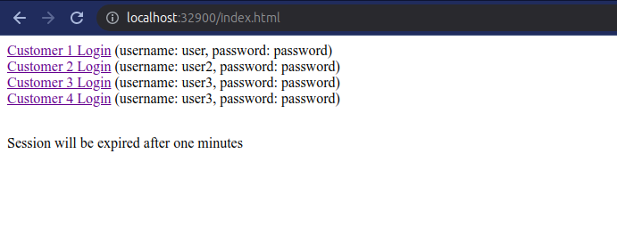
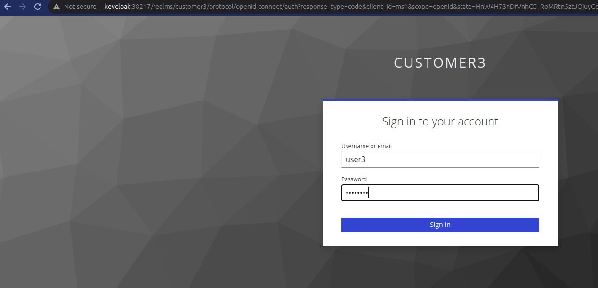
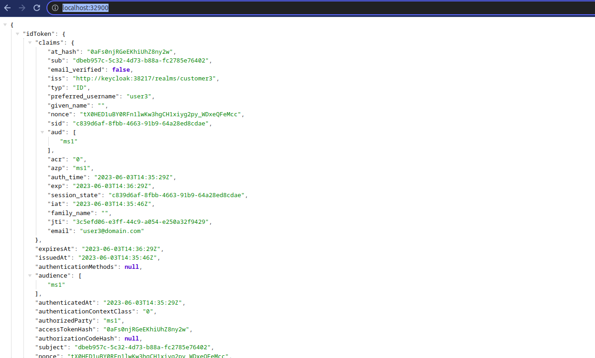

### About
This is a simple cloud api gateway that is secured with OAuth2+OIDC having multiple OIDC clients to login.

### Requirements
1. Docker, version >= 24.0.2

### How to run
1. Run `docker compose -f src/main/docker/compose.yaml up`
2. And navigate to http://localhost:32900
3. You will see following links to login in multiple customers realm (credentials are provided)  

4. Click on any link and provide the credentials (in following screenshot, I clicked on customer3 login link)

5. Expected output (OIDC user)

## Note:
After KeyCloak 21 (see [issue](https://github.com/keycloak/keycloak/pull/16879)), `curl` command is no longer working. So, for health check, we are using custom script.

See: [health-check](src/main/docker/keycloak/health-check.sh) by [this stackoverflow answer](https://stackoverflow.com/a/75693900/9010238)
and  [compose.yaml](src/main/docker/compose.yaml) that is using this script. 

We have two services (keycloak and edge-service) in docker-compose.
This application (edge-service) has graalvm native image that starts within seconds while keycloak takes 6-30 seconds to start,
So this application have to wait 6-30 seconds for KC as it needs to register oidc clients during startup.
As we cannot use `curl` command in KC container, so we are using custom script in keycloak service health check as mentioned above. 

## Another Note:
- Add `127.0.0.1 keycloak` entry in /etc/hosts file.
